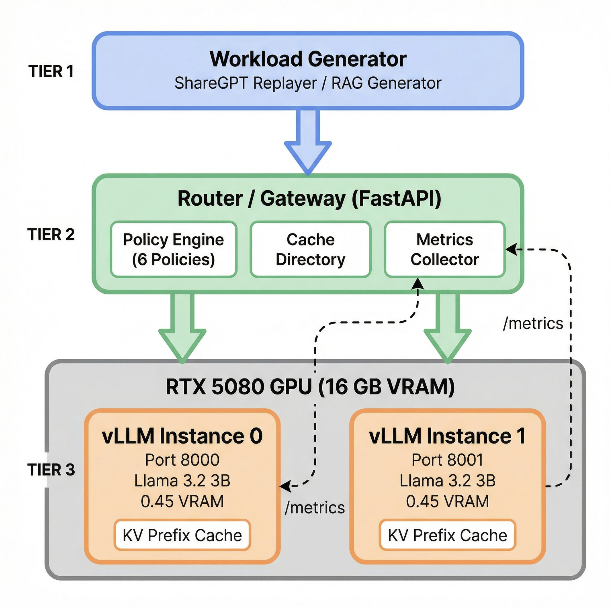

# Cache-Aware Routing for Multi-Instance LLM Serving

A reproducible evaluation of locality vs. load balance tradeoffs in gateway-level routing for distributed LLM serving.



## About

When serving an LLM to many users, it is common to run multiple model instances behind a load balancer. Each instance keeps its own KV cache of previous computations. Routing a request to an instance that already has relevant data cached makes the response much faster. However, most load balancers ignore this cache and just spread requests evenly.

This project evaluates six gateway-level routing policies for multi-instance vLLM serving and studies the tradeoff between cache reuse and load balance.

## Routing Policies

| #   | Policy                   | Type        | Description                                                  |
| --- | ------------------------ | ----------- | ------------------------------------------------------------ |
| 1   | Round-Robin              | Load-only   | Cycles through instances with no intelligence                |
| 2   | Join-Shortest-Queue      | Load-only   | Picks the instance with the fewest waiting requests          |
| 3   | Power-of-Two-Choices     | Load-only   | Samples two instances, picks the less busy one               |
| 4   | Session Affinity Hash    | Cache-aware | Sends all turns of a conversation to the same instance       |
| 5   | Prefix-Key Affinity      | Cache-aware | Routes by system prompt hash for cross-user cache sharing    |
| 6   | Load+Cache-Aware Scoring | Cache-aware | Balances cache affinity and queue depth with tunable weights |

## Research Questions

1. Under what workload characteristics does cache-aware routing improve TTFT and tail latency versus load-only routing?
2. What is the tradeoff surface between cache affinity and queueing delay, and can a simple scoring policy find robust settings?
3. How sensitive are benefits to cache directory staleness (refresh interval)?

## Hardware Setup

- 1x NVIDIA RTX 5080 (16 GB VRAM)
- 2x vLLM instances running Llama-3.2-3B-Instruct at 0.45 VRAM utilization each
- FastAPI router/gateway with pluggable policy engine

## Project Structure

```
kv-cache-routing/
├── README.md
├── docs/
│   ├── project_plan_final.md    # Full project plan with code skeletons
│   ├── project_proposal.md      # Assignment submission (source)
│   └── project_proposal.pdf     # Assignment submission (PDF)
└── paper/
    └── figures/
        └── system_architecture.png
```

## Metrics

All measurements use vLLM's native Prometheus `/metrics` endpoint for ground-truth accuracy:

- **TTFT** (P50, P95, P99) from `vllm:time_to_first_token_seconds`
- **Cache hit rate** from `vllm:prefix_cache_hit_rate`
- **KV tokens computed** from `vllm:request_prefill_kv_computed_tokens`
- **Queue depth** from `vllm:num_requests_waiting`

## References

1. Kwon et al., "Efficient Memory Management for Large Language Model Serving with PagedAttention," SOSP 2023
2. Qin et al., "Mooncake: A KVCache-centric Disaggregated Architecture for LLM Serving," FAST 2025
3. Gao et al., "Cost-Efficient Large Language Model Serving for Multi-turn Conversations with CachedAttention," USENIX ATC 2024
4. Zhu et al., "DualMap: Enabling Both Cache Affinity and Load Balancing for Distributed LLM Serving," arXiv 2025
5. Zheng et al., "SGLang: Efficient Execution of Structured Language Model Programs," NeurIPS 2024

## License

MIT
