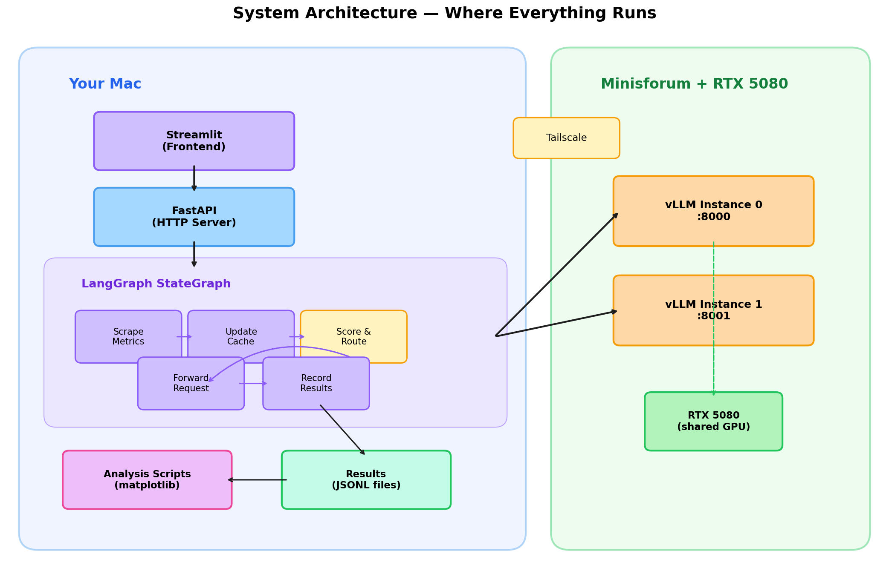
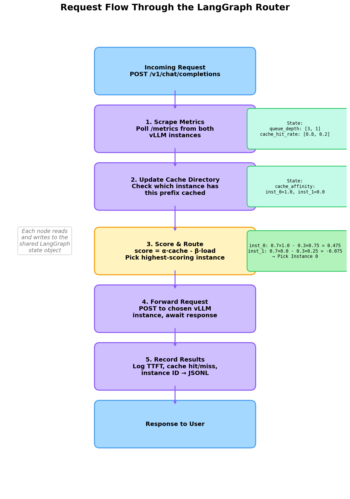
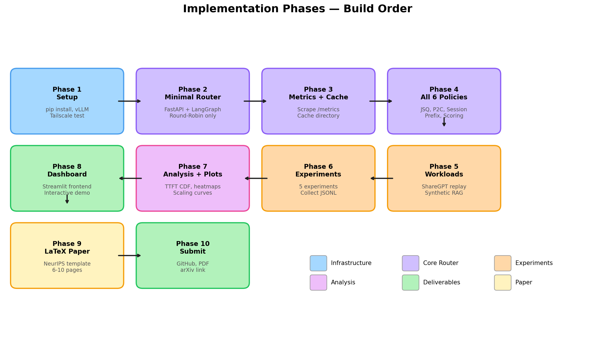

# Implementation Guide: Zero to Final Product

A step-by-step walkthrough of how to build the KV Cache Routing project from scratch.

---

## Diagrams

### System Architecture — What runs where


### Request Flow — How a single request moves through the LangGraph router


### Implementation Phases — The 10 phases in order


---

## The Big Picture

You're building a **smart traffic cop** for LLM requests. Two copies of the same model are running on your GPU machine. When a user sends a chat message, your router decides which copy should handle it. A dumb router just alternates between them. A smart router remembers what each copy has cached and sends the request to the one that can respond fastest.

Your system has 4 parts:

1. **vLLM instances** (on Minisforum) — the two model copies that actually generate responses
2. **FastAPI server** (on Mac) — the HTTP endpoint that receives user requests
3. **LangGraph router** (on Mac) — the brain that decides which vLLM instance gets each request
4. **Streamlit dashboard** (on Mac) — the UI where your professor can see it all working

---

## Phase 1: Environment Setup

**Goal:** Get all machines talking to each other and all dependencies installed.

### On your Minisforum (GPU machine)

```bash
# Install vLLM
pip install vllm

# Download the model (happens automatically on first run, ~6GB)
# Start instance 0
CUDA_VISIBLE_DEVICES=0 vllm serve unsloth/Llama-3.2-3B-Instruct \
  --port 8000 --gpu-memory-utilization 0.45 \
  --enable-prefix-caching --disable-log-requests

# In a second terminal, start instance 1
CUDA_VISIBLE_DEVICES=0 vllm serve unsloth/Llama-3.2-3B-Instruct \
  --port 8001 --gpu-memory-utilization 0.45 \
  --enable-prefix-caching --disable-log-requests
```

### On your Mac

```bash
# Core dependencies
pip install fastapi uvicorn aiohttp langgraph langchain-core

# Dashboard
pip install streamlit

# Analysis
pip install matplotlib numpy pandas seaborn

# Datasets
pip install datasets
```

### Verify connectivity

From your Mac, confirm you can reach both vLLM instances through Tailscale:

```bash
# Replace 100.x.x.x with your Minisforum's Tailscale IP
curl http://100.x.x.x:8000/v1/models
curl http://100.x.x.x:8001/v1/models
```

Both should return JSON listing the Llama model. If this works, your network is good.

**Done when:** Both `curl` commands return model info.

---

## Phase 2: Minimal Router (FastAPI + LangGraph, Round-Robin only)

**Goal:** Send a chat request to your Mac, have it forward to a vLLM instance, get a response back.

### What you're building

```
You (curl) → FastAPI (:9000) → LangGraph graph → vLLM (:8000 or :8001) → response back
```

### The pieces

**`router/state.py`** — The shared state that flows through the LangGraph graph. This is a Python dataclass holding everything the graph needs: the incoming request, metrics from each instance, the routing decision, and the final response.

**`router/nodes.py`** — The 5 functions that become LangGraph nodes:
1. `scrape_metrics` — calls `/metrics` on each vLLM instance, updates state with queue depths and cache hit rates
2. `update_cache_directory` — checks state to see if either instance likely has this request's prefix cached
3. `score_and_route` — runs the active routing policy (Round-Robin for now), writes the chosen instance ID to state
4. `forward_request` — sends the request to the chosen vLLM instance via HTTP, writes the response to state
5. `record_results` — logs the TTFT, cache hit, instance choice to a JSONL file

**`router/graph.py`** — Wires the 5 nodes into a LangGraph `StateGraph` with edges connecting them in order.

**`router/server.py`** — FastAPI app with one endpoint (`POST /v1/chat/completions`) that receives a request, runs the LangGraph graph, and returns the response.

### How they connect

```
server.py creates the FastAPI app
    ↓ on each request, calls:
graph.py invokes the StateGraph
    ↓ which runs nodes in order:
nodes.py: scrape → cache_dir → score_route → forward → record
    ↓ each node reads/writes:
state.py: the shared state object
```

### Test it

```bash
# Start the router on your Mac
uvicorn router.server:app --host 0.0.0.0 --port 9000

# Send a test request
curl -X POST http://localhost:9000/v1/chat/completions \
  -H "Content-Type: application/json" \
  -d '{
    "model": "unsloth/Llama-3.2-3B-Instruct",
    "messages": [{"role": "user", "content": "Hello, who are you?"}],
    "max_tokens": 100
  }'
```

**Done when:** You get a model response back through the router.

---

## Phase 3: Metrics Collection + Cache Directory

**Goal:** The router now knows how busy each instance is and what's cached where.

### What changes

The `scrape_metrics` node becomes real instead of a stub. It hits each vLLM instance's Prometheus `/metrics` endpoint and parses out:

- `vllm:num_requests_waiting` → queue depth (how busy)
- `vllm:prefix_cache_hit_rate` → cache effectiveness
- `vllm:time_to_first_token_seconds` → TTFT stats

The `update_cache_directory` node starts tracking routing decisions. When you send prefix P to instance 0, you record that. Next time a request with the same prefix arrives, the cache directory says "instance 0 probably has this cached."

This is "Option C" from the project plan — no vLLM modification needed. You're inferring cache state from your own routing history.

### Test it

```bash
# Send several requests, then check the router logs
# You should see queue_depth and cache_hit_rate being populated in state
```

**Done when:** The router prints real metrics from vLLM after each request.

---

## Phase 4: All 6 Routing Policies

**Goal:** Implement the remaining 5 policies (Round-Robin already works from Phase 2).

### The 6 policies

Each policy is a Python class with one method: `route(request, states) → instance_index`

| # | Policy | Logic | When it's good |
|---|---|---|---|
| 1 | **Round-Robin** | Alternate: 0, 1, 0, 1, ... | Baseline. Never good, never terrible. |
| 2 | **Join-Shortest-Queue** | Pick the instance with fewer waiting requests | Good under uneven load |
| 3 | **Power-of-Two-Choices** | Sample 2 random instances, pick less busy | Similar to JSQ, scales better at large N |
| 4 | **Session Affinity Hash** | Hash the user/session ID → always same instance | Good for multi-turn chats (same user = same cache) |
| 5 | **Prefix-Key Affinity** | Hash the system prompt → instance; fall back to JSQ if overloaded | Good for RAG (many users, same system prompt) |
| 6 | **Load+Cache-Aware Scoring** | `score = a * cache_affinity - b * load_pressure`, pick highest | The main contribution. Balances both signals. |

These all live in **`router/policies.py`**. The `score_and_route` node in the LangGraph graph calls whichever policy is active.

Policy selection is controlled by config (a YAML file or environment variable), so you can switch between them without changing code.

### Test it

```bash
# Run with each policy and check that routing decisions change
ROUTING_POLICY=round_robin uvicorn router.server:app --port 9000
ROUTING_POLICY=jsq uvicorn router.server:app --port 9000
# etc.
```

**Done when:** All 6 policies route requests and you can switch between them via config.

---

## Phase 5: Workloads

**Goal:** Create realistic request patterns to test the policies against.

### Workload 1: ShareGPT Multi-Turn Replay

Downloads real conversations from the ShareGPT dataset (people chatting with ChatGPT). Filters to conversations with 2-10 turns and 100-2000 tokens per turn. Replays them against your router at a controlled rate.

**Why it matters:** Multi-turn conversations reuse the same prefix (all previous turns). If the router sends turn 3 to the same instance as turns 1 and 2, that instance already has the KV cache for the first 2 turns — much faster.

**File:** `workloads/sharegpt_replayer.py`

### Workload 2: Synthetic RAG

Creates requests with a fixed 500-token system prompt and varying user questions. Simulates a RAG app where many different users all hit the same system prompt.

**Why it matters:** The system prompt is the same across users. If the router routes all requests with the same system prompt to the same instance, that instance caches the prompt once and reuses it. This tests cross-user prefix sharing.

**File:** `workloads/rag_generator.py`

### Workload 3: Mixed

50/50 blend of ShareGPT and RAG. Tests how policies handle diverse traffic.

**File:** `workloads/mixed_generator.py`

### Test it

```bash
# Run a small smoke workload (5 conversations, low rate)
python workloads/sharegpt_replayer.py --router http://localhost:9000 --n 5 --rate 0.5
```

**Done when:** Workloads run and produce JSONL output files with per-request data.

---

## Phase 6: Run Experiments

**Goal:** Collect the data that goes in your paper.

### The 5 experiments

**Experiment 1: Policy Comparison (Multi-Turn Chat)**
- Run all 6 policies against ShareGPT workload
- Vary request rate (0.5x, 1x, 2x)
- Collect TTFT for every request
- **Produces:** TTFT CDF plot — the main figure in your paper

**Experiment 2: RAG Workload**
- All 6 policies against synthetic RAG
- **Produces:** Cache hit rate bar chart by policy

**Experiment 3: Alpha/Beta Sweep**
- Policy 6 (scoring) only, sweep alpha from 0.0 to 1.0, beta from 0.0 to 1.0
- **Produces:** Heatmap showing which alpha/beta combo gives best P95 TTFT

**Experiment 4: Staleness Sweep**
- Policy 6, vary how often the cache directory refreshes (0ms, 100ms, 500ms, 1s, 5s, 30s)
- **Produces:** Line plot showing cache hit rate vs refresh interval

**Experiment 5: Scaling (Simulator)**
- Build a simple simulator calibrated from experiments 1-2
- Simulate N = 2, 4, 8, 16 instances
- **Produces:** Scaling plot showing TTFT P95 vs number of instances

### How to run

Each experiment is a config file in `configs/` and a runner script:

```bash
python scripts/run_experiment.py --config configs/experiment1.yaml
python scripts/run_experiment.py --config configs/experiment2.yaml
# etc.
```

Each run produces:
- `results/<experiment_id>/results.jsonl` — one row per request
- `results/<experiment_id>/summary.json` — aggregate stats

**Done when:** All 5 experiments have JSONL results files.

---

## Phase 7: Analysis + Plots

**Goal:** Turn raw data into paper-ready figures.

### The figures you need (minimum)

| # | Figure | Type | Rubric requirement |
|---|---|---|---|
| 1 | TTFT CDF | Line plot (6 lines) | "Performance comparison against baseline" |
| 2 | Cache hit rate by policy | Bar chart | Supports baseline comparison |
| 3 | Alpha/beta heatmap | Heatmap | "Performance over iterations/parameters" |
| 4 | Staleness sensitivity | Line plot | Unique contribution |
| 5 | Scaling curve | Line plot | Shows generalization |

Each figure is a script in `analysis/`:

```bash
python analysis/plot_ttft_cdf.py --input results/exp1/ --output paper/figures/ttft_cdf.png
python analysis/plot_cache_bars.py --input results/exp2/ --output paper/figures/cache_bars.png
# etc.
```

**Done when:** All 5+ figures exist as PNGs in `paper/figures/`.

---

## Phase 8: Streamlit Dashboard

**Goal:** An interactive UI your professor can use during the demo.

### What it shows

**Page 1: Live Demo**
- Dropdown to select a routing policy
- Text input to type a chat message (or button to run a mini workload)
- Real-time display: which instance was chosen, TTFT, cache hit/miss
- Live queue depth gauges for both instances

**Page 2: Experiment Results**
- Select experiment from sidebar
- View pre-generated figures (TTFT CDF, cache bars, heatmap)
- Comparison table of all policies

**Page 3: System Status**
- vLLM instance health (up/down)
- Current metrics from both instances
- Router configuration

### Run it

```bash
streamlit run dashboard/app.py
# Opens in browser at http://localhost:8501
```

**Done when:** Professor can open the dashboard, pick a policy, send a request, and see the result.

---

## Phase 9: LaTeX Paper

**Goal:** 6-10 page report in NeurIPS format.

### Required sections (from rubric)

1. **Abstract** (250 words) — Problem, method, key results
2. **Introduction** — Why does LLM serving need intelligent routing? Frame as agentic routing.
3. **Related Work** — Cite your 10+ papers (2023-2026)
4. **Methodology** — System architecture diagram, LangGraph graph design, policy descriptions, cache directory mechanism
5. **Experimental Results** — All 5 experiments, comparison tables, figures
6. **Conclusion & Ethics** — Limitations (1 GPU caveat), fairness concerns (some users getting slower instances), future work

### Template

Use the **NeurIPS LaTeX template** (not the IEEE Access template currently in the repo):
- Download from: https://neurips.cc/Conferences/2024/PaperInformation/StyleFiles
- Or use Overleaf's NeurIPS template

**Done when:** PDF compiles and is 6-10 pages with all figures.

---

## Phase 10: Package and Submit

**Goal:** Everything the rubric asks for.

### Checklist

- [ ] GitHub repo is clean with a good README
- [ ] `requirements.txt` exists and is accurate
- [ ] All code runs and is documented
- [ ] LaTeX PDF is compiled (6-10 pages)
- [ ] Paper uploaded to arXiv (get submission ID)
- [ ] Presentation slides ready (you have the Marp deck started)

---

## File Structure (what you'll end up with)

```
kv-cache-routing/
├── router/
│   ├── server.py              # FastAPI app — the HTTP entry point
│   ├── graph.py               # LangGraph StateGraph definition
│   ├── state.py               # Shared state dataclass
│   ├── nodes.py               # The 5 graph node functions
│   ├── policies.py            # All 6 routing policies
│   ├── cache_directory.py     # Prefix → instance tracking
│   └── metrics_collector.py   # Scrapes vLLM /metrics
├── workloads/
│   ├── sharegpt_replayer.py   # Multi-turn conversation replay
│   ├── rag_generator.py       # Synthetic RAG workload
│   └── mixed_generator.py     # 50/50 blend
├── simulator/
│   ├── cache_sim.py           # LRU cache model
│   └── calibrate.py           # Measure real TTFT for calibration
├── analysis/
│   ├── plot_ttft_cdf.py
│   ├── plot_cache_bars.py
│   ├── plot_heatmap.py
│   ├── plot_staleness.py
│   └── plot_scaling.py
├── dashboard/
│   └── app.py                 # Streamlit frontend
├── scripts/
│   ├── launch_vllm.sh         # Start both vLLM instances
│   └── run_experiment.py      # Config-driven experiment runner
├── configs/
│   ├── experiment1.yaml
│   ├── experiment2.yaml
│   ├── experiment3.yaml
│   ├── experiment4.yaml
│   └── experiment5.yaml
├── results/                   # Generated data (gitignored)
├── paper/
│   ├── main.tex               # NeurIPS format LaTeX
│   └── figures/               # Generated plots
├── requirements.txt
└── README.md
```

---

## Order of Operations (what depends on what)

```
Phase 1 (Setup)
  └→ Phase 2 (Minimal Router) — needs vLLM running
       └→ Phase 3 (Metrics + Cache) — needs router working
            └→ Phase 4 (All Policies) — needs metrics for smart policies
                 └→ Phase 5 (Workloads) — needs policies to test against
                      └→ Phase 6 (Experiments) — needs workloads + policies
                           ├→ Phase 7 (Plots) — needs experiment data
                           └→ Phase 8 (Dashboard) — can start in parallel with plots
                                └→ Phase 9 (Paper) — needs plots + results
                                     └→ Phase 10 (Submit)
```

Phases 7 and 8 can run in parallel — the dashboard doesn't need finished plots, and plots don't need the dashboard.
